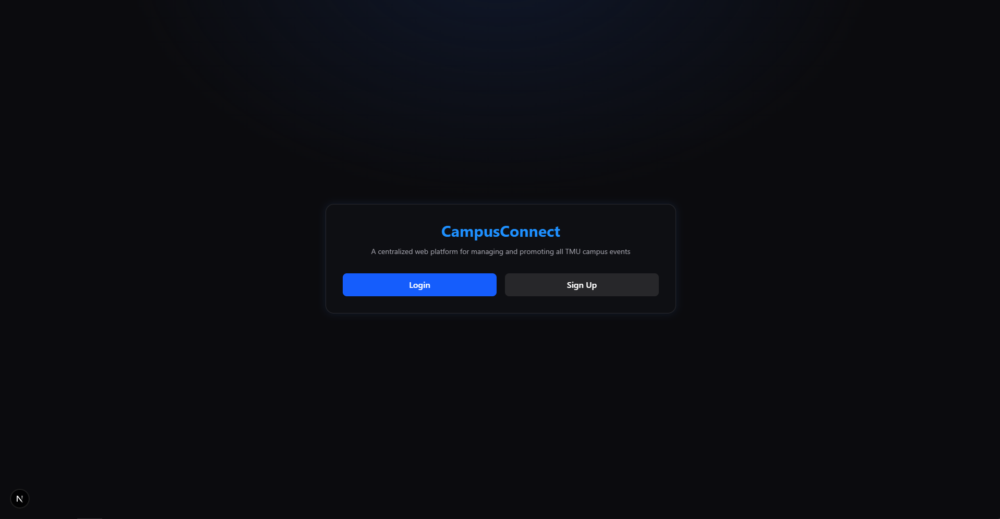
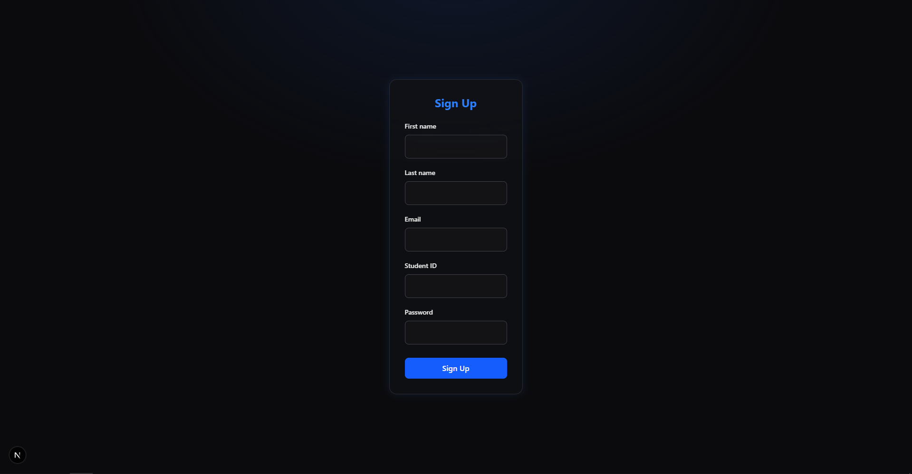
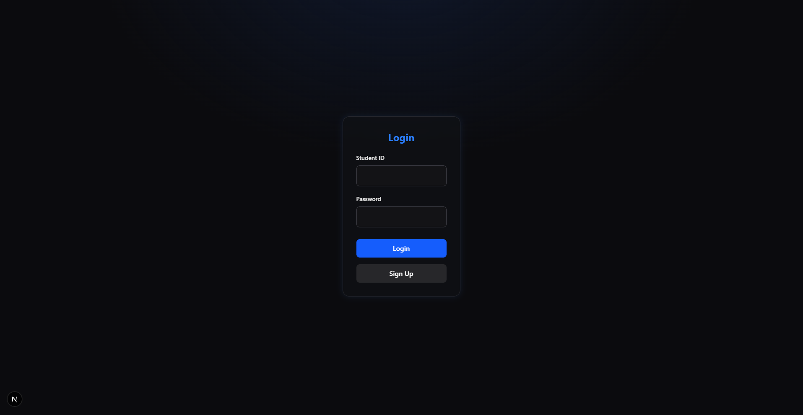
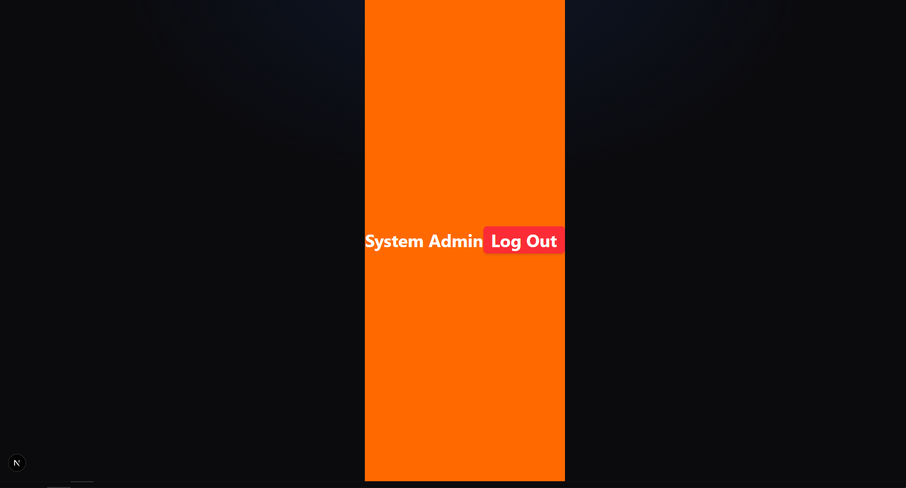
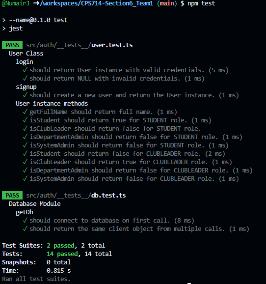

# Team 1
- root/
  - README-team1.md
  - src/
      - app/
         - api/
            - login/
            - logout/
            - signup/
         - lib/
            - getCurrentUsers.ts
         - dashboard_test/
         - login/
         - signup/
         - globals.css
         - page.tsx
      - auth/

## Prerequisites

- [Node.js](https://nodejs.org/)
- [Next.js](https://nextjs.org)
- [Docker](https://www.docker.com)
- [Migration Tool](https://github.com/golang-migrate/migrate)

# Getting Started on Opening the App

0. Download the Team One artifact, which stores the User authentication and Role Management subproject

1. Install dependencies
   ```bash
   npm install
   ```
2. Configure environment variables.Use the sample file as a starting point:
   ```bash
   cp .env.example .env
   ```
3. Start Docker services defined in `docker-compose.yml`:
   ```bash
   docker compose up -d
   ```
4. Launch the app
   ```bash
   npm run dev
5. Open App in browser
   ```
   http://localhost:3000
# Features
Upon opening the app, you will be greeted by the homepage. You can access the sign up or log in via the buttons
Code: /src/app/page.tsx


The sign up page provides input for name, email, student number and password. 
Code: /src/app/signup/page.tsx


The log in page provides input for student number and password. Also provides sign up button in case user needs to make an account.
Code: /src/app/login/page.tsx


The dashboard page presents a simple demonstration of the user's role and a log out button.
Code: /src/app/dashboard_test/page.tsx


# Useful things to know

## Manually connecting to the database
```bash
# Connect to the database inside the container:
docker exec -it cps714_postgres /bin/bash
psql -d campus_connect_db
```

## Database operations
```bash
# List all databases
\list

# Select a database
\c <database>

# List tables in current database
\dt
```

## Database schema
```sql
CREATE TABLE public.users (
    id bigint NOT NULL,
    first_name text NOT NULL,
    last_name text NOT NULL,
    email text NOT NULL,
    student_id text NOT NULL,
    password text NOT NULL,
    permission_level smallint DEFAULT 0 NOT NULL
);
```

## Log off Button
``` Javascript
//Adding the logout button can be done so by importing the component/logoutbutton.tsx to your page.
import LogoutButton from "../component/logoutbutton";
return (
      <LogoutButton />
  );
//Please look at dashboard_test for implementation
```

## User Session
``` Javascript
// The authentication and user session are managed by cookies. 
// The public lib getCurrentUser function allows reusable session information
// Read in the session data:
import { getCurrentUser } from "@/app/lib/getCurrentUser";

const user = await getCurrentUser(); // await the async function
  if (!user) {
    return (
      <div className="flex h-screen items-center justify-center bg-gray-100 text-red-600 text-xl">
        No token found. Please <a href="/login" className="underline ml-1">login</a>.
      </div>
    );
  }
// Roles are managed via an enum in User.ts:
export enum Role {
    TEST = 0,
    STUDENT = 1,
    CLUBLEADER = 2,
    DEPARTMENTADMIN = 3,
    SYSTEMADMIN = 4,
}
//Please look at dashboard_test for implementation
```

## Test Cases
```bash
# After completing getting started
# In the root directory of the project run:
npm test

#Code: src/auth/__test__/
```

